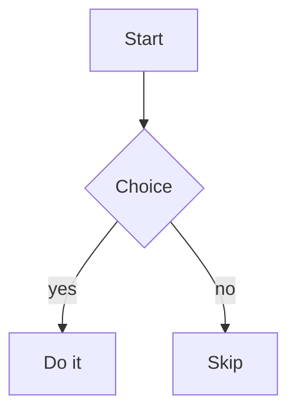

# Mermaid Diagram Rendering Implementation Plan

> **For agentic workers:** REQUIRED SUB-SKILL: Use superpowers:subagent-driven-development (recommended) or superpowers:executing-plans to implement this plan task-by-task. Steps use checkbox (`- [ ]`) syntax for tracking.

**Goal:** Render fenced ` ```mermaid ` blocks in the desktop markdown reader as inline SVG diagrams (dark theme), falling back to the original code on parse failure.

**Architecture:** `renderMarkdown()` stays a pure sync function but emits a marker `<pre class="aip-mermaid">` for mermaid fences. A new `mermaid.ts` module lazily imports mermaid and swaps those markers for SVG after the HTML is injected into the DOM. `doc-reader.ts` invokes that pass inside its existing async `loadBody()` guard.

**Tech Stack:** TypeScript, markdown-it, DOMPurify, mermaid v11, Vitest + jsdom, electron-vite.

---

## File Structure

- `apps/desktop/package.json` — add `mermaid` dependency.
- `apps/desktop/src/renderer/chrome/markdown.ts` — add mermaid fence-rule override (keeps `renderMarkdown` sync).
- `apps/desktop/src/renderer/chrome/markdown.test.ts` — add marker-emission tests.
- `apps/desktop/src/renderer/chrome/mermaid.ts` — NEW: `renderMermaidBlocks(container)`.
- `apps/desktop/src/renderer/chrome/mermaid.test.ts` — NEW: render/fallback/lazy-load tests.
- `apps/desktop/src/renderer/chrome/doc-reader.ts` — call `renderMermaidBlocks` in `loadBody()`.
- `apps/desktop/src/renderer/chrome/styles/chrome.css` — diagram + error-banner styles.

All test commands run from `apps/desktop`. Use `cd apps/desktop` first (the package has its own `vitest`).

---

## Task 1: Add the mermaid dependency

**Files:**
- Modify: `apps/desktop/package.json:26-34` (dependencies block)

- [ ] **Step 1: Add the dependency**

In `apps/desktop/package.json`, add `mermaid` to `dependencies` (alphabetical order, after `markdown-it`):

```json
    "markdown-it": "^14.2.0",
    "mermaid": "^11.4.1",
    "node-pty": "^1.1.0"
```

- [ ] **Step 2: Install**

Run (from repo root, this is a pnpm workspace): `pnpm install`
Expected: completes, `mermaid` resolved into the workspace. If the resolver picks a newer 11.x, that is fine.

- [ ] **Step 3: Commit**

```bash
git add apps/desktop/package.json pnpm-lock.yaml
git commit -m "build(desktop): add mermaid dependency"
```

---

## Task 2: Emit a marker element for mermaid fences

The default markdown-it fence renderer turns ` ```mermaid ` into
`<pre><code class="language-mermaid">…</code></pre>`. We override the fence rule
so mermaid blocks become `<pre class="aip-mermaid"><code>…</code></pre>` (raw
source preserved as escaped text), while every other language falls through to
the default renderer untouched.

**Files:**
- Modify: `apps/desktop/src/renderer/chrome/markdown.ts`
- Test: `apps/desktop/src/renderer/chrome/markdown.test.ts`

- [ ] **Step 1: Write the failing tests**

Add to `markdown.test.ts` inside the existing `describe('renderMarkdown', …)`:

```ts
  it('emits an aip-mermaid marker for mermaid fences', () => {
    const html = renderMarkdown('```mermaid\ngraph TD; A-->B\n```');
    expect(html).toContain('class="aip-mermaid"');
    // raw source preserved as (escaped) text content
    expect(html).toContain('graph TD; A--&gt;B');
    expect(html).not.toContain('language-mermaid');
  });

  it('leaves non-mermaid fences as normal code blocks', () => {
    const html = renderMarkdown('```\nconst x = 1;\n```');
    expect(html).toContain('<pre>');
    expect(html).not.toContain('aip-mermaid');
    expect(html).toContain('const x = 1;');
  });
```

- [ ] **Step 2: Run tests to verify they fail**

Run: `cd apps/desktop && npx vitest run src/renderer/chrome/markdown.test.ts`
Expected: the new `aip-mermaid` test FAILS (output still contains `language-mermaid`); existing tests pass.

- [ ] **Step 3: Implement the fence override**

Replace the body of `markdown.ts` above `renderMarkdown` with:

```ts
import MarkdownIt from 'markdown-it';
import DOMPurify from 'dompurify';

const md = new MarkdownIt({
  html: true,
  linkify: true,
  breaks: false,
});

// Render ```mermaid fences to a marker element that survives DOMPurify and
// preserves the raw source as text. mermaid.ts swaps these for SVG after the
// HTML is injected into the DOM. All other languages use the default renderer.
const defaultFence =
  md.renderer.rules.fence ??
  ((tokens, idx, options, _env, self) => self.renderToken(tokens, idx, options));
md.renderer.rules.fence = (tokens, idx, options, env, self) => {
  const token = tokens[idx]!;
  const info = token.info.trim().split(/\s+/)[0] ?? '';
  if (info === 'mermaid') {
    return `<pre class="aip-mermaid"><code>${md.utils.escapeHtml(token.content)}</code></pre>`;
  }
  return defaultFence(tokens, idx, options, env, self);
};
```

Leave `renderMarkdown` and `countLoc` unchanged below this.

- [ ] **Step 4: Run tests to verify they pass**

Run: `cd apps/desktop && npx vitest run src/renderer/chrome/markdown.test.ts`
Expected: all tests PASS (including `sanitizes script tags` and `strips event-handler attributes` — confirming DOMPurify keeps `class="aip-mermaid"`).

- [ ] **Step 5: Commit**

```bash
git add apps/desktop/src/renderer/chrome/markdown.ts apps/desktop/src/renderer/chrome/markdown.test.ts
git commit -m "feat(reader): mark mermaid fences for later rendering"
```

---

## Task 3: Render marked blocks to SVG (mermaid.ts)

New module owning all mermaid concerns: lazy import, one-time init, per-block
render, and the error fallback. mermaid is imported via dynamic `import()` and a
module-level `loadMermaid()` memo so it is only fetched once and never fetched at
all when a document has no diagrams.

**Files:**
- Create: `apps/desktop/src/renderer/chrome/mermaid.ts`
- Test: `apps/desktop/src/renderer/chrome/mermaid.test.ts`

- [ ] **Step 1: Write the failing tests**

Create `mermaid.test.ts`:

```ts
// @vitest-environment jsdom
import { afterEach, describe, expect, it, vi } from 'vitest';
import { renderMermaidBlocks } from './mermaid.js';

// Mock the mermaid module. render() returns a marker SVG; initialize() is spied.
const renderMock = vi.fn(async (id: string, src: string) => ({
  svg: `<svg data-id="${id}"><title>${src}</title></svg>`,
}));
const initializeMock = vi.fn();
vi.mock('mermaid', () => ({
  default: { initialize: initializeMock, render: renderMock },
}));

afterEach(() => {
  vi.clearAllMocks();
});

function host(html: string): HTMLElement {
  const el = document.createElement('div');
  el.innerHTML = html;
  return el;
}

describe('renderMermaidBlocks', () => {
  it('replaces a marker with the rendered SVG', async () => {
    const el = host('<pre class="aip-mermaid"><code>graph TD; A--&gt;B</code></pre>');
    await renderMermaidBlocks(el);
    expect(el.querySelector('svg')).not.toBeNull();
    expect(el.querySelector('pre.aip-mermaid')).toBeNull();
    expect(initializeMock).toHaveBeenCalledTimes(1);
  });

  it('renders every marker when there are several', async () => {
    const el = host(
      '<pre class="aip-mermaid"><code>graph TD; A-->B</code></pre>' +
        '<pre class="aip-mermaid"><code>graph LR; C-->D</code></pre>',
    );
    await renderMermaidBlocks(el);
    expect(el.querySelectorAll('svg')).toHaveLength(2);
    expect(renderMock).toHaveBeenCalledTimes(2);
  });

  it('shows an error banner and keeps the source when render fails', async () => {
    renderMock.mockRejectedValueOnce(new Error('Parse error on line 2'));
    const el = host('<pre class="aip-mermaid"><code>bad diagram</code></pre>');
    await renderMermaidBlocks(el);
    expect(el.querySelector('svg')).toBeNull();
    expect(el.querySelector('.aip-mermaid-error')).not.toBeNull();
    expect(el.textContent).toContain('Parse error on line 2');
    // original code retained, marker class removed so it is not re-processed
    expect(el.querySelector('pre')).not.toBeNull();
    expect(el.querySelector('pre.aip-mermaid')).toBeNull();
    expect(el.textContent).toContain('bad diagram');
  });

  it('does not import mermaid when there are no markers', async () => {
    const el = host('<p>no diagrams here</p>');
    await renderMermaidBlocks(el);
    expect(initializeMock).not.toHaveBeenCalled();
    expect(renderMock).not.toHaveBeenCalled();
  });
});
```

- [ ] **Step 2: Run tests to verify they fail**

Run: `cd apps/desktop && npx vitest run src/renderer/chrome/mermaid.test.ts`
Expected: FAIL — `Cannot find module './mermaid.js'` / `renderMermaidBlocks is not a function`.

- [ ] **Step 3: Implement the module**

Create `mermaid.ts`:

```ts
type MermaidApi = {
  initialize: (config: Record<string, unknown>) => void;
  render: (id: string, source: string) => Promise<{ svg: string }>;
};

let mermaidPromise: Promise<MermaidApi> | null = null;
let initialized = false;
let idSeq = 0;

/** Lazily load mermaid once and initialize it once (dark, non-interactive). */
async function loadMermaid(): Promise<MermaidApi> {
  if (!mermaidPromise) {
    mermaidPromise = import('mermaid').then((m) => m.default as MermaidApi);
  }
  const mermaid = await mermaidPromise;
  if (!initialized) {
    mermaid.initialize({ startOnLoad: false, theme: 'dark', securityLevel: 'strict' });
    initialized = true;
  }
  return mermaid;
}

/**
 * Find pre.aip-mermaid markers in `container` and replace each with rendered
 * SVG. On failure, insert an error banner and keep the original code block.
 * Imports mermaid only when at least one marker is present.
 */
export async function renderMermaidBlocks(container: HTMLElement): Promise<void> {
  const blocks = Array.from(container.querySelectorAll<HTMLElement>('pre.aip-mermaid'));
  if (blocks.length === 0) return;

  const mermaid = await loadMermaid();

  for (const block of blocks) {
    const source = block.textContent ?? '';
    const id = `aip-mermaid-${++idSeq}`;
    try {
      const { svg } = await mermaid.render(id, source);
      const wrapper = document.createElement('div');
      wrapper.className = 'aip-mermaid-rendered';
      wrapper.innerHTML = svg;
      block.replaceWith(wrapper);
    } catch (err) {
      const banner = document.createElement('div');
      banner.className = 'aip-mermaid-error';
      banner.textContent = `Diagram error: ${err instanceof Error ? err.message : String(err)}`;
      block.classList.remove('aip-mermaid'); // leave source visible, don't re-process
      block.before(banner);
    }
  }
}
```

- [ ] **Step 4: Run tests to verify they pass**

Run: `cd apps/desktop && npx vitest run src/renderer/chrome/mermaid.test.ts`
Expected: all 4 tests PASS.

- [ ] **Step 5: Commit**

```bash
git add apps/desktop/src/renderer/chrome/mermaid.ts apps/desktop/src/renderer/chrome/mermaid.test.ts
git commit -m "feat(reader): render mermaid blocks to SVG with error fallback"
```

---

## Task 4: Invoke the render pass from the reader

Call `renderMermaidBlocks(bodyEl)` after the markdown HTML is injected in
`loadBody()`, reusing the existing stale-render guard.

**Files:**
- Modify: `apps/desktop/src/renderer/chrome/doc-reader.ts:3` (import) and `:165-167` (content branch)

- [ ] **Step 1: Add the import**

In `doc-reader.ts`, after line 3 (`import { renderMarkdown, countLoc } …`), add:

```ts
import { renderMermaidBlocks } from './mermaid.js';
```

- [ ] **Step 2: Invoke the pass in the content branch**

In `loadBody()`, replace the existing `if ('content' in res) { … }` block (currently lines 165-167):

```ts
    if ('content' in res) {
      bodyEl.innerHTML = `<div class="aip-reader__prose">${renderMarkdown(res.content)}</div>`;
      statsEl.textContent = `${countLoc(res.content)} LOC · ${formatKb(res.sizeBytes)}`;
    } else if ('tooLarge' in res) {
```

with:

```ts
    if ('content' in res) {
      bodyEl.innerHTML = `<div class="aip-reader__prose">${renderMarkdown(res.content)}</div>`;
      statsEl.textContent = `${countLoc(res.content)} LOC · ${formatKb(res.sizeBytes)}`;
      // Mermaid renders asynchronously; bail if the active doc changed mid-render
      // or the body was detached so we never write SVG into a stale panel.
      await renderMermaidBlocks(bodyEl);
      if (token !== this.loadToken || !bodyEl.isConnected) return;
    } else if ('tooLarge' in res) {
```

- [ ] **Step 3: Typecheck**

Run: `cd apps/desktop && npx tsc -p tsconfig.json --noEmit`
Expected: no errors.

- [ ] **Step 4: Run the full desktop test suite**

Run: `cd apps/desktop && npx vitest run`
Expected: all tests PASS (markdown, mermaid, doc-reader, and the rest).

- [ ] **Step 5: Commit**

```bash
git add apps/desktop/src/renderer/chrome/doc-reader.ts
git commit -m "feat(reader): render mermaid diagrams after loading doc body"
```

---

## Task 5: Style the rendered diagrams and error banner

**Files:**
- Modify: `apps/desktop/src/renderer/chrome/styles/chrome.css` (after line 1194, the existing `.aip-reader__prose pre code` rule)

- [ ] **Step 1: Add the styles**

After the `.aip-reader__prose pre code { … }` rule (line 1194), add:

```css
.aip-reader__prose .aip-mermaid-rendered { margin: 0 0 16px; text-align: center; }
.aip-reader__prose .aip-mermaid-rendered svg { max-width: 100%; height: auto; }
.aip-reader__prose .aip-mermaid-error {
  font-family: var(--font-mono); font-size: 11.5px; color: var(--st-limited);
  background: var(--st-limited-bg); border: 1px solid var(--st-limited-ring);
  border-radius: 6px; padding: 8px 12px; margin: 0 0 8px;
}
```

- [ ] **Step 2: Commit**

```bash
git add apps/desktop/src/renderer/chrome/styles/chrome.css
git commit -m "style(reader): style rendered mermaid diagrams and error banner"
```

---

## Task 6: Manual verification in the running app

**Files:** none (manual check).

- [ ] **Step 1: Build to confirm the dynamic import resolves under electron-vite**

Run: `cd apps/desktop && npx electron-vite build`
Expected: build succeeds; mermaid is emitted as a separate lazily-loaded chunk (not folded into the main renderer entry).

- [ ] **Step 2: Run the app and open a markdown doc containing a diagram**

Run: `cd apps/desktop && npx electron-vite dev`
Open the reader on a markdown file containing:

````markdown

````

Expected: the block renders as a dark SVG flowchart scaled to the panel width.

- [ ] **Step 3: Verify the error fallback**

Add a broken block (e.g. ` ```mermaid `\n`graph TD; A --` ) and confirm a red
"Diagram error: …" banner appears above the original source code.

- [ ] **Step 4: Verify a doc with no diagrams still renders normally**

Open a plain markdown doc; confirm it renders unchanged and quickly.

---

## Self-Review notes

- **Spec coverage:** lazy load (Task 1/3 `loadMermaid` memo + "no markers" test), error+code fallback (Task 3 error test + Task 5 banner), inline-only render (no zoom code), dark built-in theme (Task 3 `initialize`), strict security (Task 3 `initialize`), no double-sanitize (SVG inserted directly, never through DOMPurify), pure sync `renderMarkdown` (Task 2 keeps it sync), token guard (Task 4), tests (Tasks 2-3), dependency (Task 1). All covered.
- **Type consistency:** `renderMermaidBlocks(container: HTMLElement): Promise<void>` used identically in mermaid.ts, its test, and doc-reader.ts. Marker class `aip-mermaid`, rendered wrapper `aip-mermaid-rendered`, error `aip-mermaid-error` consistent across markdown.ts, mermaid.ts, and chrome.css.
- **Note:** `electron-vite dev`/`build` are run manually in Task 6; if mermaid's dynamic import needs `optimizeDeps` tuning, address it there (it should resolve out of the box).
